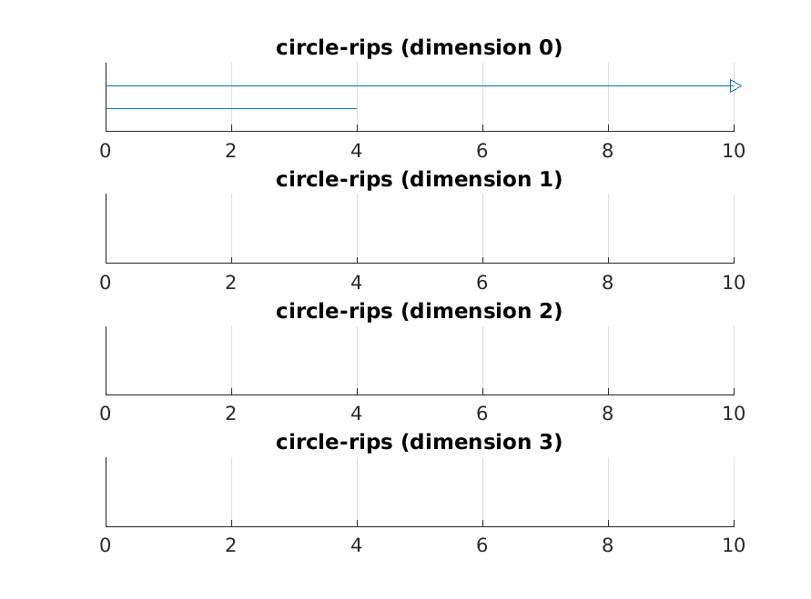

# Redemption Set

Author: George Bernard

## Problem 1

```matlab
%% Problem 1: Taxicab distance and VR complexes
clear; format short; close all;

load_javaplex;
import edu.stanford.math.plex4.*;

%% Problem Givens

S = [0, 0;
     1, 0;
     0, 1;
     1, 1;
     0, 5;
     5, 5;
     5, 0];

n = size(S, 1);
distances = zeros(n, n);
manhat_dist = @(x, y) sum(abs(x - y));

for i = 1:n
    for j = 1:n
        x = S(i, :);
        y = S(j, :);
        distances(i, j) = manhat_dist(x, y);
    end
end

%% Construct the metric space

m_space = metric.impl.ExplicitMetricSpace(distances);

%% Construct the VR complex

max_dimension = 3;
max_filt_value = 11;
num_divisions = 1000;

stream = api.Plex4.createVietorisRipsStream(m_space, max_dimension, ...
    max_filt_value, num_divisions);

%% Calculate persistence
persistence = api.Plex4.getModularSimplicialAlgorithm(max_dimension, 2);
intervals = persistence.computeIntervals(stream);

%% Show Results

options.filename = 'VR-taxicab';
options.max_filtration_value = max_filt_value;
options.max_dimension = max_dimension - 1;
plot_barcodes(intervals, options);
```


## Problem 2

```matlab
%% Problem 2: Assorted Javaplex Tutorial Exercises

%% Exercise 8
% Compute VR complex of a house point cloud
clear; format short; close all

load_javaplex;
import edu.stanford.math.plex4.*;

house = [ ...
    -1, 0;
     1, 0;
    -1, 2;
     1, 2;
     0, 3;
     4, 0;
     4, 2
    ];
house_rand = house + 0.1 .* randn(size(house));

% plot the house
scatter(house(:, 1), house(:, 2));
grid on;
hold on;
scatter(house_rand(:, 1), house_rand(:, 2));
legend('original', 'noise added')

% Compute the VR stream
m_space = metric.impl.EuclideanMetricSpace(house);
max_dim = 3;
max_filt_value = 4;
num_divisions = 1000;

stream = api.Plex4.createVietorisRipsStream(m_space, max_dim, ...
    max_filt_value, num_divisions);

persistence = api.Plex4.getModularSimplicialAlgorithm(max_dim, 2);
intervals = persistence.computeIntervals(stream);

options.filename = 'rips-house';
options.max_filtration_value = max_filt_value;
options.max_dimension = max_dim - 1;
plot_barcodes(intervals, options);

%% Exercise 9
clear; format short; close all

load_javaplex;
import edu.stanford.math.plex4.*;

point_cloud = examples.PointCloudExamples.getRandomFigure8Points(75);

% Compute the VR stream
m_space = metric.impl.EuclideanMetricSpace(point_cloud);
max_dim = 3;
max_filt_value = 1.1;
num_divisions = 1000;

stream = api.Plex4.createVietorisRipsStream(m_space, max_dim, ...
    max_filt_value, num_divisions);

persistence = api.Plex4.getModularSimplicialAlgorithm(max_dim, 2);
intervals = persistence.computeIntervals(stream);

options.filename = 'rips-house';
options.max_filtration_value = max_filt_value;
options.max_dimension = max_dim - 1;
plot_barcodes(intervals, options);

%% Exercise 10
clear; format short; close all

load_javaplex;
import edu.stanford.math.plex4.*;

point_cloud = examples.PointCloudExamples.getRandomTorusPoints(500, 1, 2);

scatter3(point_cloud(:,1), point_cloud(:,2), point_cloud(:, 3))
axis equal;

% Compute the VR stream
m_space = metric.impl.EuclideanMetricSpace(point_cloud);
max_dim = 3;
max_filt_value = 0.9;
num_divisions = 100;

stream = api.Plex4.createVietorisRipsStream(m_space, max_dim, ...
    max_filt_value, num_divisions);

persistence = api.Plex4.getModularSimplicialAlgorithm(max_dim, 2);
intervals = persistence.computeIntervals(stream);

options.filename = 'torus-rips';
options.max_filtration_value = max_filt_value;
options.max_dimension = max_dim - 1;
plot_barcodes(intervals, options);

%% Exercise 11
clear; format short; close all

load_javaplex;
import edu.stanford.math.plex4.*;

sampled_angles = @(n) (2*pi/n).*(0:n-1);
sampled_circle = @(n) [cos(sampled_angles(n)); sin(sampled_angles(n))];

n = 16;
circle = sampled_circle(n);

m_space = metric.impl.EuclideanMetricSpace(circle);
max_dim = 4;
max_filt_value = 10;
num_divisions = 10000;

stream = api.Plex4.createVietorisRipsStream(m_space, max_dim, ...
    max_filt_value, num_divisions);

persistence = api.Plex4.getModularSimplicialAlgorithm(max_dim, 2);
intervals = persistence.computeIntervals(stream);

options.filename = 'circle-rips';
options.max_filtration_value = max_filt_value;
options.max_dimension = max_dim - 1;
plot_barcodes(intervals, options);

% for many of these values, I can never get a homology above dimension 1

%% Exercise 12

% pick unit square, with given 
dataset = [0, 0; 1, 0; 0, 1; 1, 1];
m_space = metric.impl.EuclideanMetricSpace(dataset);
max_dim = 3;
max_filt_value = 1.1;
num_divisions = 1000;

stream = api.Plex4.createVietorisRipsStream(m_space, max_dim, ...
    max_filt_value, num_divisions);

persistence = api.Plex4.getModularSimplicialAlgorithm(max_dim, 2);
intervals = persistence.computeIntervals(stream);

options.filename = 'square-rips';
options.max_filtration_value = max_filt_value;
options.max_dimension = max_dim - 1;
plot_barcodes(intervals, options);
```





## Problem 3

Did not complete

## Problem 4

```matlab
%% Problem 4: Dunce Cap Betti Numbers
clear; format short

load_javaplex;
import edu.stanford.math.plex4.*;

%% Problem Given Data
num_vertices = 8;

edges = ...
[1, 2; 1, 3; 1, 4; 1, 5; 1, 6; 1, 7; 1, 8;
 2, 3; 2, 4; 2, 5; 2, 6; 2, 7; 2, 8;
 3, 4; 3, 5; 3, 6; 3, 7; 3, 8;
 4, 5; 4, 8;
 5, 6; 5, 8;
 6, 7; 6, 8;
 7, 8];

faces = ...
[1, 2, 4;
1, 2, 5;
1, 2, 8;
1, 3, 6;
1, 3, 7;
1, 3, 8;
1, 4, 5;
1, 6, 7;
2, 3, 4;
2, 3, 6;
2, 3, 7;
2, 5, 6;
2, 7, 8;
3, 4, 8;
4, 5, 8;
5, 6, 8;
6, 7, 8];

%% Set up Simplicial Complex
stream = api.Plex4.createExplicitSimplexStream();

for v = 1:num_vertices
    stream.addVertex(v);
end

for e_i = 1:size(edges, 1)
    stream.addElement(edges(e_i, :))
end

for f_i = 1:size(faces, 1)
    stream.addElement(faces(f_i, :))
end

stream.finalizeStream();

%% Calculate betti Numbers
persistence = api.Plex4.getModularSimplicialAlgorithm(4, 2);
intervals = persistence.computeIntervals(stream);
infinite_barcodes = intervals.getInfiniteIntervals();
```

## Problem 5

The two rules to an elementary collapse are:
1. The collapse must be on a coface in a lower dimension
2. The lower coface must not be an element in any other maximal face

The second rule makes collapsing the dunce cap infeasible. None of the edges are present in only one 3-dim face (all of them present in two faces), thus there are no edges that can be collapsed. 